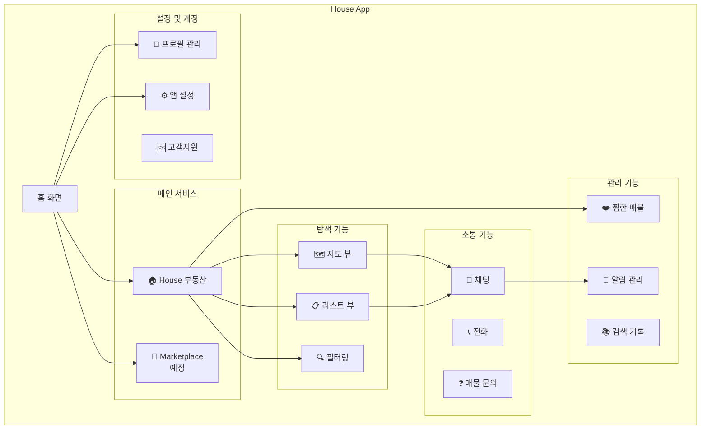
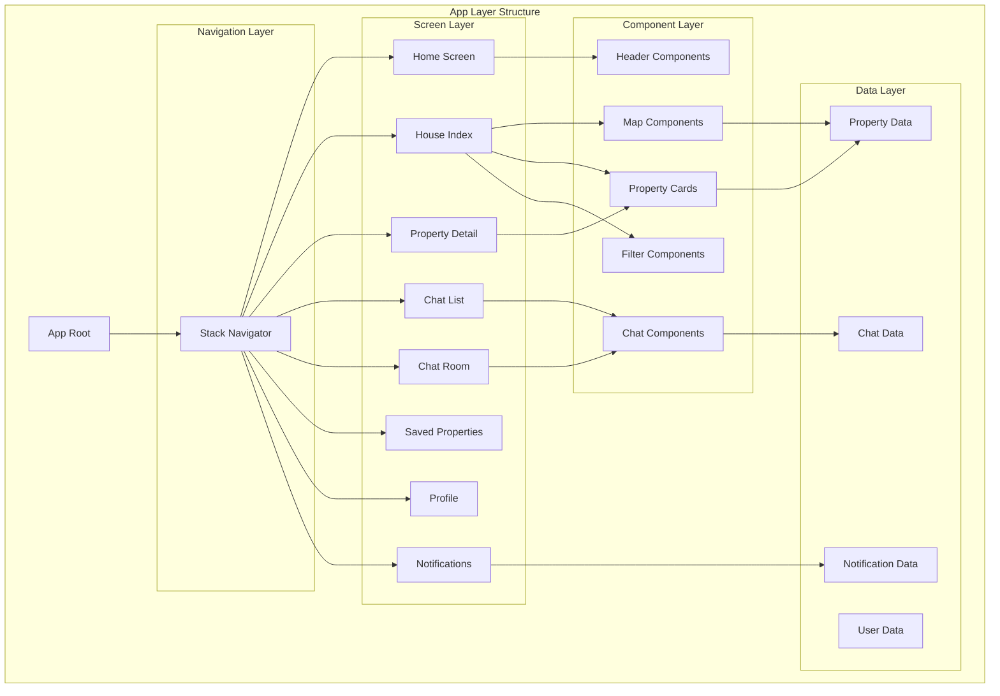
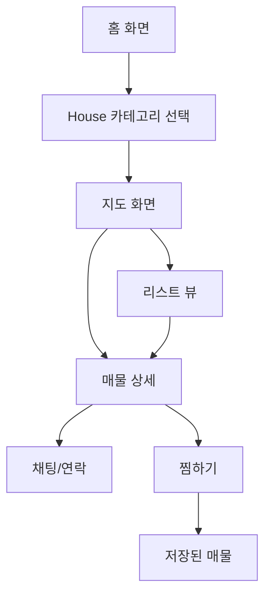
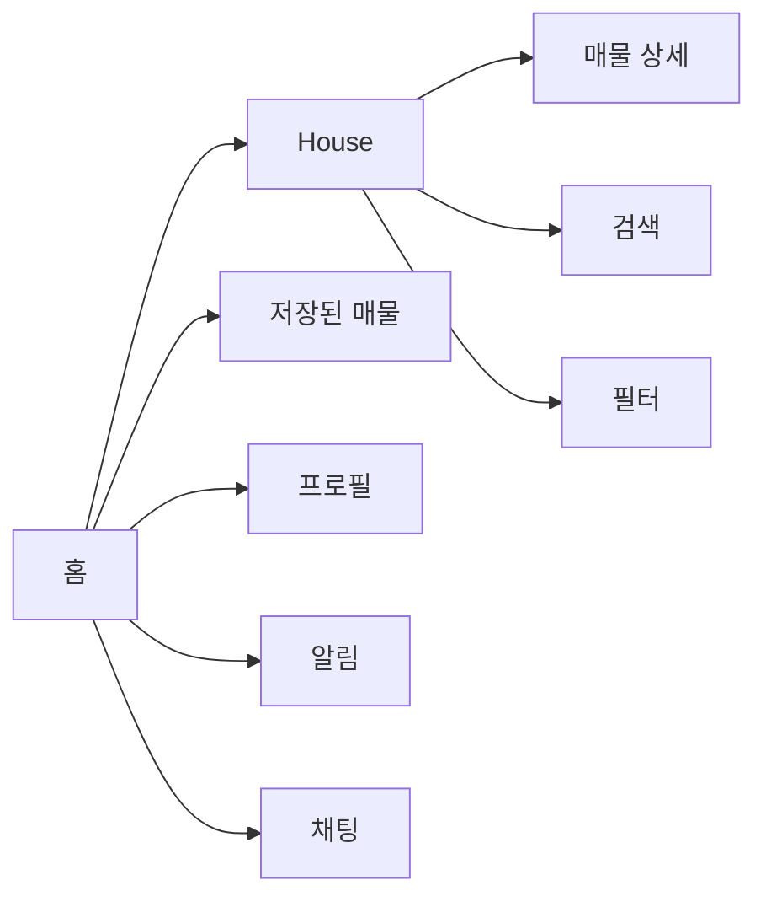
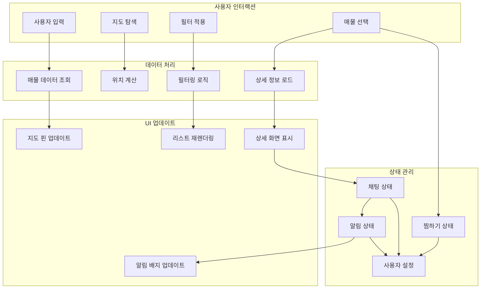
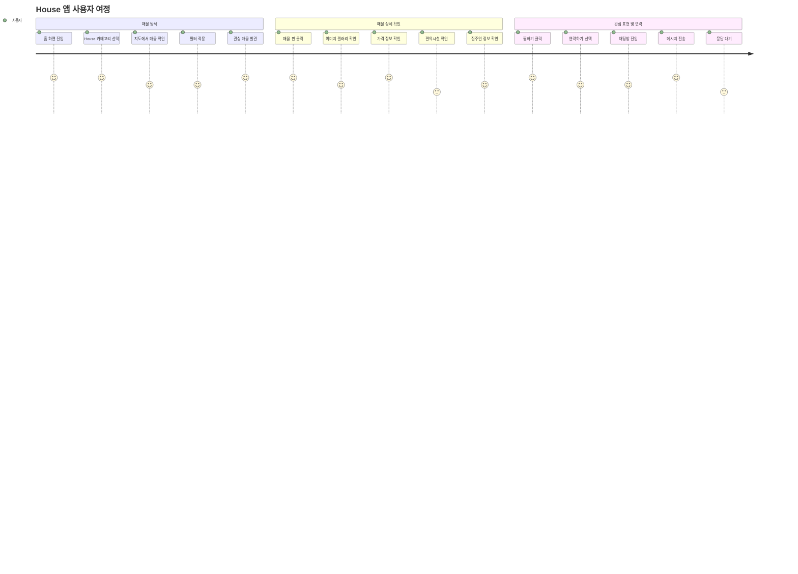
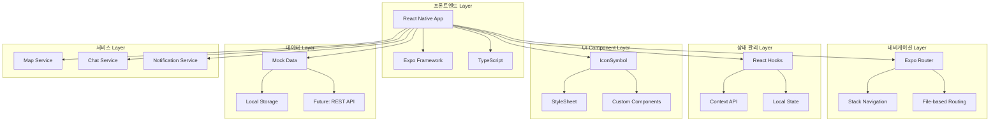

# House 서비스 구조도

## 📋 목차
1. [서비스 개요](#서비스-개요)
2. [앱 구조도](#앱-구조도)
3. [화면 플로우](#화면-플로우)
4. [기능 구조](#기능-구조)
5. [데이터 구조](#데이터-구조)
6. [네비게이션 구조](#네비게이션-구조)

---

## 📱 서비스 개요

**House**는 외국인을 위한 한국 부동산 플랫폼으로, 직관적인 지도 기반 매물 탐색과 실시간 소통 기능을 제공합니다.

### 핵심 특징
- 🗺️ 지도 기반 매물 탐색 (직방 스타일)
- 💬 실시간 채팅 시스템
- 🔔 스마트 알림 서비스
- 🌏 외국인 친화적 UX

---

## 🏗️ 앱 구조도

### 전체 서비스 아키텍처


### 화면 계층 구조


---

## 🔄 화면 플로우

### 1. 메인 플로우


### 2. 네비게이션 플로우


### 3. 데이터 플로우


### 4. 사용자 여정 시각화


---

## ⚙️ 기능 구조

### 🏠 House 서비스
```
House Service
├── 매물 탐색
│   ├── 지도 뷰
│   │   ├── 매물 핀 표시
│   │   ├── 가격 정보 표시
│   │   └── 하단 매물 카드
│   │
│   ├── 리스트 뷰
│   │   ├── 추천 매물
│   │   └── 인기 매물
│   │
│   └── 필터링
│       ├── 위치 (역 근처)
│       ├── 가격대
│       ├── 방 타입
│       └── 편의시설
│
├── 매물 상세
│   ├── 이미지 갤러리
│   ├── 가격/보증금 정보
│   ├── 위치/교통 정보
│   ├── 편의시설
│   ├── 집주인 정보
│   └── 연락 기능
│
└── 상호작용
    ├── 찜하기
    ├── 공유하기
    ├── 채팅하기
    └── 전화하기
```

### 💬 채팅 시스템
```
Chat System
├── 채팅방 목록
│   ├── 활성 대화
│   ├── 최근 대화
│   └── 읽지 않은 메시지
│
├── 개별 채팅방
│   ├── 매물별 분리
│   ├── 실시간 메시징
│   ├── 온라인 상태
│   └── 메시지 상태
│
└── 알림
    ├── 새 메시지 알림
    ├── 읽음 상태
    └── 배지 표시
```

### 🔔 알림 시스템
```
Notification System
├── 알림 타입
│   ├── 가격 하락
│   ├── 새 매물 추천
│   ├── 새 메시지
│   └── 상태 변경
│
├── 알림 관리
│   ├── 읽음/안읽음
│   ├── 시간별 분류
│   └── 중요도 구분
│
└── 설정
    ├── 알림 ON/OFF
    ├── 알림 타입 선택
    └── 시간 설정
```

---

## 🗃️ 데이터 구조

### 매물 데이터
```typescript
Property {
  id: string
  title: string
  price: string
  deposit: string
  location: string
  address: string
  details: string
  description: string
  amenities: string[]
  images: string[]
  coordinates: { lat: number, lng: number }
  ownerInfo: Owner
  availability: Availability
  isLiked: boolean
}
```

### 사용자 데이터
```typescript
User {
  id: string
  name: string
  email: string
  profileImage?: string
  memberSince: string
  isVerified: boolean
  preferences: UserPreferences
  activity: UserActivity
}
```

### 채팅 데이터
```typescript
ChatRoom {
  id: string
  propertyId: string
  propertyTitle: string
  ownerName: string
  lastMessage: string
  timestamp: string
  unreadCount: number
  isOnline: boolean
}
```

---

## 🧭 네비게이션 구조

### 라우트 구조
```
App Routes
├── / (홈)
├── /house
│   ├── /house/index (지도/리스트)
│   ├── /house/[id] (매물 상세)
│   └── /house/search (검색)
│
├── /saved (찜한 매물)
├── /profile (프로필)
├── /notifications (알림)
└── /chat
    ├── /chat/index (채팅 목록)
    └── /chat/[id] (개별 채팅)
```

### 네비게이션 패턴
- **Stack Navigation**: 전체 앱 구조
- **Header Navigation**: 뒤로가기, 찜하기, 프로필
- **Modal Navigation**: 필터, 설정 팝업
- **Tab-like Navigation**: 지도/리스트 토글

---

## 🎯 주요 사용자 여정

### 1. 매물 찾기 여정
```
홈 진입 → House 선택 → 지도 탐색 → 필터 적용 → 
매물 선택 → 상세 확인 → 찜하기/연락하기
```

### 2. 소통하기 여정
```
매물 상세 → Contact Owner → 채팅방 생성 → 
메시지 교환 → 방문 예약 → 계약 논의
```

### 3. 관리하기 여정
```
찜한 매물 확인 → 가격 변동 알림 → 
새로운 추천 매물 → 관심사 업데이트
```

### 5. 기술 아키텍처


### 6. 컴포넌트 아키텍처
```mermaid
graph TD
    subgraph "App Structure"
        A[App Root _layout.tsx]
        
        subgraph "Screen Components"
            B[HomeScreen index.tsx]
            C[HouseScreen house/index.tsx]
            D[PropertyDetail house/[id].tsx]
            E[SavedScreen saved.tsx]
            F[ProfileScreen profile.tsx]
            G[NotificationsScreen notifications.tsx]
            H[ChatListScreen chat/index.tsx]
            I[ChatRoomScreen chat/[id].tsx]
        end
        
        subgraph "Shared Components"
            J[Header Component]
            K[Navigation Buttons]
            L[Property Card]
            M[Map Pin]
            N[Filter Chips]
            O[Chat Bubble]
        end
        
        subgraph "UI Components"
            P[IconSymbol]
            Q[TouchableOpacity]
            R[ScrollView]
            S[SafeAreaView]
        end
    end
    
    A --> B
    A --> C
    A --> D
    A --> E
    A --> F
    A --> G
    A --> H
    A --> I
    
    B --> J
    C --> J
    C --> K
    C --> L
    C --> M
    C --> N
    D --> L
    H --> O
    I --> O
    
    J --> P
    K --> P
    L --> P
    M --> P
    N --> P
    O --> P
    
    J --> Q
    J --> R
    J --> S
```

---

## 🔧 기술 스택

### Frontend
- **React Native** + **Expo**
- **TypeScript**
- **Expo Router** (File-based routing)
- **React Native Reanimated**

### 상태 관리
- **React Hooks** (useState, useEffect)
- **Context API** (전역 상태)

### 네비게이션
- **Expo Router** + **React Navigation**
- **Stack Navigation Pattern**

### UI/UX
- **React Native StyleSheet**
- **IconSymbol** 컴포넌트
- **Responsive Design**

---

## 📈 확장 계획

### 단기 계획
- 실제 지도 API 연동 (Google Maps/Naver Maps)
- 백엔드 API 연동
- 실시간 채팅 구현
- 푸시 알림 서비스

### 중장기 계획
- Marketplace 서비스 추가
- 다국어 지원 (영어, 중국어, 일본어)
- AI 기반 매물 추천
- VR/AR 매물 투어

---

*이 문서는 House 앱의 현재 구조와 향후 발전 방향을 담고 있습니다.*
*최종 수정일: 2024-11-09*