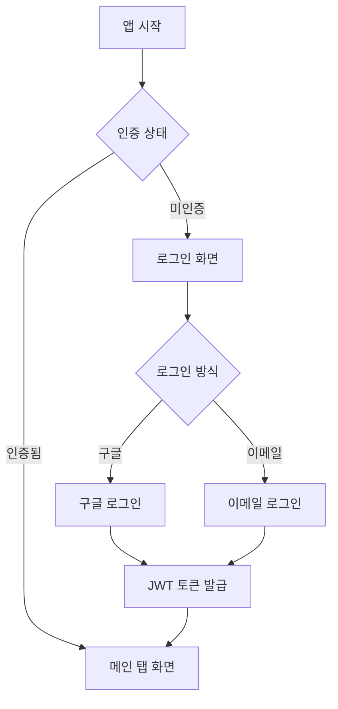
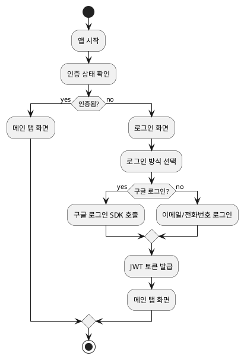

# 플로우차트 (Flow Diagram)

> 관련 문서: [서비스 기획서](./service-guide.md), [기능 명세서](./functional-spec.md)

## 1. 문서 개요

### 1.1 목적

이 문서는 부동산 서비스의 주요 사용자 플로우와 로직 플로우를 다이어그램으로 표현합니다.

### 1.2 표기법

-   **사각형**: 프로세스/액션
-   **마름모**: 조건/판단
-   **타원**: 시작/종료
-   **화살표**: 플로우 방향

## 2. 사용자 플로우

### 2.1 앱 시작 플로우

```
[앱 시작]
  ↓
[인증 상태 확인]
  ↓
  ├─ [인증됨] → [메인 탭 화면]
  │
  └─ [미인증] → [로그인 화면]
```

### 2.2 로그인 플로우

```
[로그인 화면]
  ↓
[로그인 방식 선택]
  ↓
  ├─ [구글 로그인] → [구글 로그인 SDK 호출]
  │                     ↓
  │                  [ID 토큰 획득]
  │                     ↓
  │                  [서버에 토큰 전송]
  │                     ↓
  │                  [사용자 정보 조회/생성]
  │                     ↓
  │                  [JWT 토큰 발급]
  │                     ↓
  │                  [메인 탭 화면]
  │
  └─ [이메일/전화번호 로그인] → [이메일/전화번호 입력]
                                  ↓
                               [비밀번호 입력]
                                  ↓
                               [서버에 인증 요청]
                                  ↓
                               [인증 성공?]
                                  ├─ [성공] → [JWT 토큰 발급] → [메인 탭 화면]
                                  └─ [실패] → [에러 메시지 표시] → [로그인 화면]
```

### 2.3 회원가입 플로우

```
[회원가입 화면]
  ↓
[Step 1: 기본 정보 입력]
  ↓
[이메일/전화번호 입력]
  ↓
[인증 코드 발송]
  ↓
[인증 코드 입력]
  ↓
[인증 코드 확인]
  ↓
  ├─ [성공] → [Step 2: 비밀번호 설정]
  │             ↓
  │          [비밀번호 입력]
  │             ↓
  │          [비밀번호 확인]
  │             ↓
  │          [비밀번호 일치?]
  │             ├─ [일치] → [Step 3: 프로필 입력]
  │             │             ↓
  │             │          [이름 입력]
  │             │             ↓
  │             │          [약관 동의]
  │             │             ↓
  │             │          [회원가입 완료]
  │             │             ↓
  │             │          [JWT 토큰 발급]
  │             │             ↓
  │             │          [메인 탭 화면]
  │             │
  │             └─ [불일치] → [에러 메시지 표시]
  │
  └─ [실패] → [에러 메시지 표시]
```

### 2.4 매물 검색 플로우

```
[홈 화면]
  ↓
[검색어 입력 또는 필터 선택]
  ↓
[검색 실행]
  ↓
[서버에 검색 요청]
  ↓
[검색 결과 수신]
  ↓
[결과 있음?]
  ├─ [있음] → [검색 결과 화면]
  │            ↓
  │         [매물 리스트 표시]
  │            ↓
  │         [매물 카드 클릭]
  │            ↓
  │         [매물 상세 화면]
  │
  └─ [없음] → [검색 결과 없음 메시지 표시]
```

### 2.5 지도 기반 검색 플로우

```
[지도 화면]
  ↓
[지도 초기화]
  ↓
[현재 위치 또는 기본 위치로 이동]
  ↓
[지도 영역 내 매물 조회]
  ↓
[매물 마커 표시]
  ↓
[지도 이동/줌]
  ↓
[지도 영역 변경 감지]
  ↓
[새로운 영역 내 매물 조회]
  ↓
[마커 업데이트]
  ↓
[마커 클릭]
  ↓
[매물 정보 카드 표시]
  ↓
[카드 클릭]
  ↓
[매물 상세 화면]
```

### 2.6 매물 상세 조회 플로우

```
[매물 상세 화면]
  ↓
[매물 ID로 정보 조회]
  ↓
[조회수 증가]
  ↓
[기본 정보 표시]
  ↓
[이미지 갤러리 표시]
  ↓
[옵션 및 편의시설 표시]
  ↓
[주변 정보 표시]
  ↓
[사용자 액션]
  ↓
  ├─ [찜하기] → [찜 추가/제거]
  │              ↓
  │           [찜 수 업데이트]
  │
  ├─ [문의하기] → [문의 메시지 입력]
  │                ↓
  │             [채팅방 생성 또는 조회]
  │                ↓
  │             [채팅 화면으로 이동]
  │
  └─ [공유하기] → [공유 옵션 선택]
                   ↓
                [링크 공유]
```

### 2.7 부동산업자 매물 조회 플로우

```
[부동산업자 전용 화면]
  ↓
[부동산업자 인증 확인]
  ↓
[담당 매물 목록 조회]
  ↓
[매물 리스트 표시]
  ↓
[매물 카드 클릭]
  ↓
[담당 매물 확인]
  ↓
[매물 상세 정보 조회]
  ↓
[매물 상세 화면]
  ↓
[문의 목록 조회]
  ↓
[문의 관리 화면]
```

### 2.8 채팅 플로우

```
[채팅 목록 화면]
  ↓
[채팅방 목록 조회]
  ↓
[채팅방 클릭]
  ↓
[채팅 화면]
  ↓
[Socket.io 연결]
  ↓
[채팅방 입장]
  ↓
[메시지 히스토리 조회]
  ↓
[메시지 리스트 표시]
  ↓
[메시지 입력]
  ↓
[메시지 전송]
  ↓
[서버에 메시지 저장]
  ↓
[Socket.io로 실시간 전송]
  ↓
[상대방에게 메시지 수신]
  ↓
[메시지 읽음 처리]
  ↓
[읽음 상태 업데이트]
```

### 2.9 찜하기 플로우

```
[매물 상세 화면]
  ↓
[찜하기 버튼 클릭]
  ↓
[로그인 확인]
  ↓
  ├─ [로그인됨] → [찜 상태 확인]
  │                ↓
  │             [이미 찜함?]
  │                ├─ [찜함] → [찜 제거]
  │                │            ↓
  │                │         [찜 수 감소]
  │                │            ↓
  │                │         [UI 업데이트]
  │                │
  │                └─ [안 찜함] → [찜 추가]
  │                               ↓
  │                            [찜 수 증가]
  │                               ↓
  │                            [UI 업데이트]
  │
  └─ [미로그인] → [로그인 화면으로 이동]
```

## 3. 로직 플로우

### 3.1 매물 검색 로직 플로우

```
[검색 요청]
  ↓
[필터 조건 파싱]
  ↓
[검색 조건 구성]
  ↓
[데이터베이스 쿼리]
  ↓
[결과 필터링]
  ↓
[정렬 적용]
  ↓
[페이지네이션]
  ↓
[결과 반환]
```

### 3.2 부동산업자 매물 조회 로직 플로우

```
[담당 매물 조회 요청]
  ↓
[부동산업자 인증 확인]
  ↓
[인증 통과?]
  ├─ [통과] → [담당 매물 목록 조회]
  │            ↓
  │         [매물 필터링]
  │            ↓
  │         [페이지네이션]
  │            ↓
  │         [결과 반환]
  │
  └─ [실패] → [인증 에러 반환]
```

### 3.3 채팅 메시지 전송 로직 플로우

```
[메시지 전송 요청]
  ↓
[채팅방 접근 권한 확인]
  ↓
[권한 있음?]
  ├─ [있음] → [메시지 내용 검증]
  │            ↓
  │         [검증 통과?]
  │            ├─ [통과] → [Rate Limiting 확인]
  │            │            ↓
  │            │         [제한 통과?]
  │            │            ├─ [통과] → [메시지 저장]
  │            │            │            ↓
  │            │            │         [Socket.io로 전송]
  │            │            │            ↓
  │            │            │         [상대방 온라인?]
  │            │            │            ├─ [온라인] → [실시간 전송]
  │            │            │            └─ [오프라인] → [푸시 알림 발송]
  │            │            │
  │            │            └─ [실패] → [Rate Limit 에러]
  │            │
  │            └─ [실패] → [검증 에러]
  │
  └─ [없음] → [권한 에러]
```

### 3.4 이미지 업로드 로직 플로우

```
[이미지 업로드 요청]
  ↓
[이미지 파일 검증]
  ↓
[파일 크기 확인]
  ↓
[크기 OK?]
  ├─ [OK] → [파일 형식 확인]
  │         ↓
  │      [형식 OK?]
  │         ├─ [OK] → [이미지 압축]
  │         │         ↓
  │         │      [압축 완료]
  │         │         ↓
  │         │      [S3/Cloudinary 업로드]
  │         │         ↓
  │         │      [업로드 성공?]
  │         │         ├─ [성공] → [URL 저장]
  │         │         │            ↓
  │         │         │         [업로드 완료]
  │         │         │
  │         │         └─ [실패] → [재시도 (최대 3회)]
  │         │
  │         └─ [NG] → [형식 에러]
  │
  └─ [NG] → [크기 에러]
```

### 3.5 알림 발송 로직 플로우

```
[알림 발송 요청]
  ↓
[사용자 FCM 토큰 조회]
  ↓
[토큰 있음?]
  ├─ [있음] → [알림 설정 확인]
  │            ↓
  │         [알림 켜짐?]
  │            ├─ [켜짐] → [알림 타입 확인]
  │            │            ↓
  │            │         [메시지 알림?]
  │            │            ├─ [메시지] → [채팅방 진입 여부 확인]
  │            │            │            ↓
  │            │            │         [진입 안 함?]
  │            │            │            ├─ [안 함] → [푸시 알림 발송]
  │            │            │            └─ [함] → [알림 발송 안 함]
  │            │            │
  │            │            └─ [기타] → [푸시 알림 발송]
  │            │
  │            └─ [꺼짐] → [알림 발송 안 함]
  │
  └─ [없음] → [알림 발송 안 함]
```

## 4. 에러 처리 플로우

### 4.1 네트워크 오류 처리

```
[API 요청]
  ↓
[네트워크 연결 확인]
  ↓
[연결 OK?]
  ├─ [OK] → [요청 전송]
  │         ↓
  │      [응답 수신]
  │         ↓
  │      [성공?]
  │         ├─ [성공] → [데이터 처리]
  │         │
  │         └─ [실패] → [에러 타입 확인]
  │                     ↓
  │                  [401 Unauthorized?]
  │                     ├─ [401] → [토큰 갱신] → [재시도]
  │                     │
  │                  [403 Forbidden?]
  │                     ├─ [403] → [권한 에러 표시]
  │                     │
  │                  [404 Not Found?]
  │                     ├─ [404] → [리소스 없음 에러 표시]
  │                     │
  │                  [500 Server Error?]
  │                     ├─ [500] → [서버 에러 표시] → [재시도 (최대 3회)]
  │                     │
  │                  [기타] → [에러 메시지 표시]
  │
  └─ [NG] → [오프라인 모드 확인]
            ↓
         [오프라인 모드?]
            ├─ [켜짐] → [로컬 캐시 사용]
            └─ [꺼짐] → [네트워크 연결 안내]
```

### 4.2 인증 오류 처리

```
[API 요청]
  ↓
[인증 토큰 포함]
  ↓
[서버 응답]
  ↓
[401 Unauthorized?]
  ├─ [401] → [토큰 만료 확인]
  │         ↓
  │      [만료됨?]
  │         ├─ [만료] → [리프레시 토큰으로 갱신]
  │         │            ↓
  │         │         [갱신 성공?]
  │         │            ├─ [성공] → [원래 요청 재시도]
  │         │            └─ [실패] → [로그인 화면으로 이동]
  │         │
  │         └─ [유효] → [권한 없음 에러 표시]
  │
  └─ [기타] → [정상 처리]
```

## 5. 상태 관리 플로우

### 5.1 매물 상태 변경 플로우

```
[매물 상태 변경 요청]
  ↓
[매물 소유자 확인]
  ↓
[소유자 맞음?]
  ├─ [맞음] → [현재 상태 확인]
  │            ↓
  │         [available?]
  │            ├─ [available] → [변경할 상태 선택]
  │            │                  ↓
  │            │               [reserved?]
  │            │                  ├─ [reserved] → [예약중으로 변경]
  │            │                  │                  ↓
  │            │                  │               [상태 업데이트]
  │            │                  │
  │            │                  └─ [sold] → [거래완료로 변경]
  │            │                                 ↓
  │            │                              [상태 업데이트]
  │            │                                 ↓
  │            │                              [리뷰 작성 안내]
  │            │
  │            └─ [reserved/sold] → [상태 변경 불가 에러]
  │
  └─ [아님] → [권한 없음 에러]
```

### 5.2 채팅방 상태 관리 플로우

```
[채팅방 상태 변경]
  ↓
[채팅방 타입 확인]
  ↓
  ├─ [일반 채팅] → [참여자 확인]
  │                ↓
  │             [2명 참여?]
  │                ├─ [2명] → [활성 상태 유지]
  │                └─ [1명 이하] → [비활성 상태]
  │
  └─ [매물 문의] → [매물 상태 확인]
                    ↓
                 [매물 available?]
                    ├─ [available] → [활성 상태 유지]
                    └─ [sold] → [비활성 상태 (읽기 전용)]
```

## 6. 데이터 동기화 플로우

### 6.1 오프라인 데이터 동기화

```
[앱 시작]
  ↓
[네트워크 연결 확인]
  ↓
[연결됨?]
  ├─ [연결됨] → [로컬 변경사항 확인]
  │            ↓
  │         [변경사항 있음?]
  │            ├─ [있음] → [서버에 동기화]
  │            │            ↓
  │            │         [동기화 성공?]
  │            │            ├─ [성공] → [로컬 데이터 업데이트]
  │            │            └─ [실패] → [재시도 대기열에 추가]
  │            │
  │            └─ [없음] → [서버에서 최신 데이터 가져오기]
  │
  └─ [연결 안 됨] → [오프라인 모드 활성화]
                    ↓
                 [로컬 캐시 사용]
```

## 7. 플로우 다이어그램 참고

### 7.1 Mermaid 다이어그램 예시



### 7.2 PlantUML 다이어그램 예시



---

**작성일**: 2024년
**버전**: 1.0
**업데이트**: 프로젝트 진행에 따라 지속적으로 업데이트
